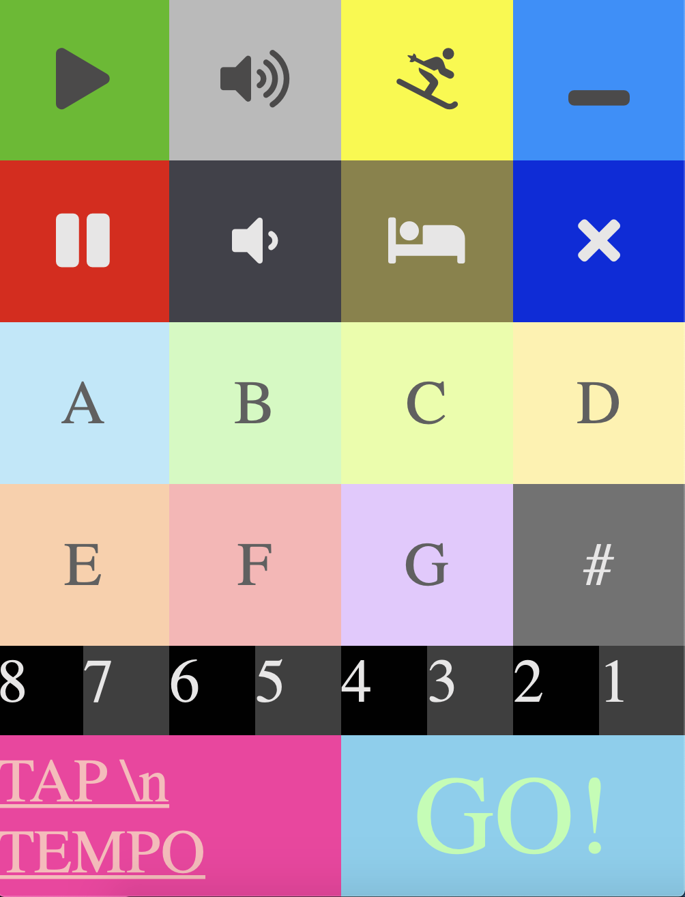

# Gunky Funky APP

### mission statment 

My brother is currently in a nice little psychedelic funk band, a little noisy, lots of noise and improvision.

He suggested I make an orchestrator control app for his band where one person can set the temp, the key the band is to play in, and style of change... 

I will be using JS under the hood and still needing to learn how to have a display screen and a app control panel interacting with eachother. 

